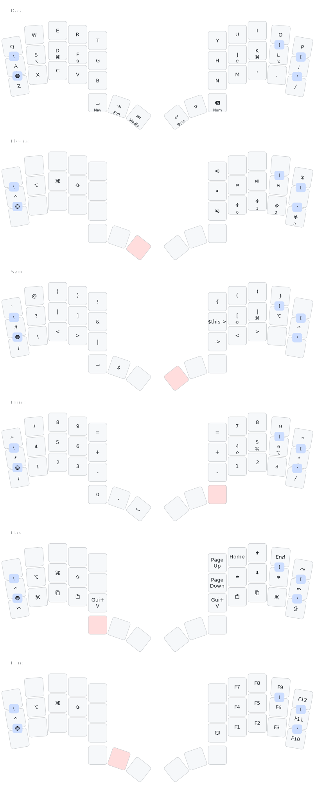

# ZMK config for [LIKEeb](https://github.com/HolyErgo/likeeb)

To customize layout make fork of this repository and then edit it with [Keymap Editor](https://nickcoutsos.github.io/keymap-editor/).

