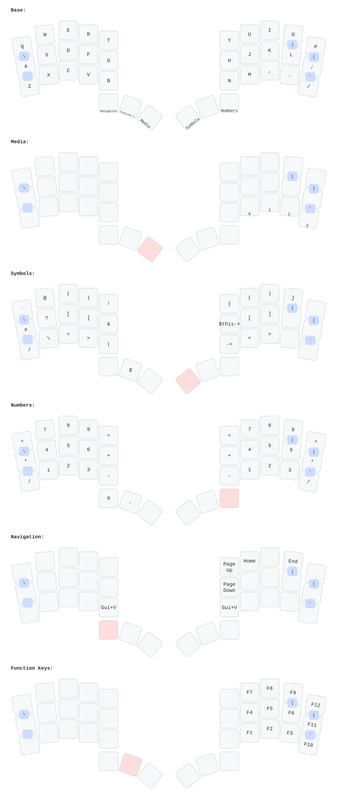

# ZMK config for [Likeeb](https://github.com/HolyErgo/likeeb)

Supports [ZMK Studio](https://zmk.dev/docs/features/studio#building). `&studio_unlock` is on 'Function keys' layer.

You can fork of this repository and customize layout with [Keymap Editor](https://nickcoutsos.github.io/keymap-editor/).

